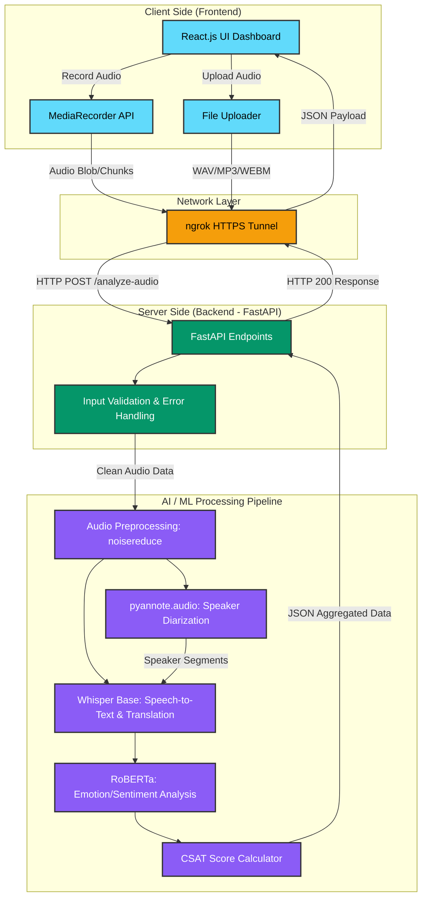

# System Design: Voice-to-Text and Sentiment Interpreter

This document outlines the system architecture and design for the Voice-to-Text and Sentiment Interpreter project. It covers the core components, data flow, and the technology stack utilized to build this full-stack AI application.

## 1. System Architecture Diagram

The system follows a modern decoupled Client-Server architecture with a specialized Machine Learning pipeline for processing audio and text.

## 2. Component Breakdown

### A. Client Side (Presentation Layer)
- **Framework:** React.js
- **Responsibilities:**
  - Provide a dynamic, responsive UI featuring a chat-style dashboard.
  - Handle user permissions and secure audio capture via the browser's `MediaRecorder` API.
  - Manage state for ongoing recordings, historical data viewing, and UI feedback (toast notifications for errors/guidelines).
  - Send asynchronous HTTP requests with payload forms to the backend.

### B. Network & Security Layer
- **Tool:** ngrok
- **Responsibilities:**
  - Create secure HTTP/HTTPS tunnels to localhost.
  - Fulfill strict browser security requirements (Secure Context) necessary for accessing the microphone on external devices (like a second laptop or mobile phone).

### C. Server Side (Application Layer)
- **Framework:** FastAPI (Python)
- **Responsibilities:**
  - Serve as the central orchestrator handling incoming API requests (`/analyze-audio`).
  - Perform strict input validation (checking MIME types to ensure only supported formats like WAV, MP3, and WEBM are processed).
  - Implement graceful error handling and logging to prevent server crashes on malformed inputs.

### D. AI & ML Pipeline (Processing Layer)
- **Audio Preprocessing (`noisereduce`):** Cleans the raw audio input to remove background static, improving the accuracy of downstream models.
- **Speaker Diarization (`pyannote.audio`):** Analyzes the audio to answer "who spoke when," dividing the track into distinct speaker segments.
- **Speech-to-Text & Translation (Whisper `base`):** Processes the audio segments to generate text transcriptions. It also utilizes its translation task to seamlessly convert regional languages (e.g., Marathi) into English.
- **Emotion Classification (HuggingFace RoBERTa):** Replaces basic VADER sentiment analysis to provide granular, segment-level emotion detection (e.g., anger, joy, neutral) on the transcribed text.
- **Analytics Engine:** Aggregates sentiment and transcript data to calculate a quantitative 1-10 Client Satisfaction (CSAT) score.

## 3. Data Flow Execution (The "Happy Path")

1. **Capture:** A user clicks "Record" on the React interface. The browser captures microphone input via the `MediaRecorder` API.
2. **Transmit:** The audio blob is packaged into a `FormData` object and sent via POST request through the ngrok HTTPS tunnel to the FastAPI backend.
3. **Validate:** FastAPI verifies the file type and size. If invalid, it immediately returns a 4xx error (handled by frontend toast notifications).
4. **Process Audio:** The valid audio file is passed to `noisereduce` for cleaning, then simultaneously passed to `pyannote.audio` (for speaker timestamps) and `Whisper` (for text and translation).
5. **Process Text:** The transcribed text segments are fed into the `RoBERTa` model to extract emotional context.
6. **Aggregate & Return:** The backend maps the text, emotion, and speaker data together, calculates the CSAT score, and packages it into a unified JSON response.
7. **Display:** The React frontend receives the JSON and dynamically renders the multi-speaker chat dashboard, displaying the text, assigned speaker, emotion tags, and final CSAT score.
